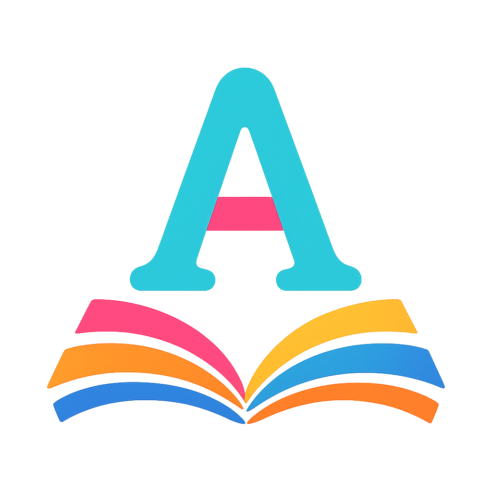

# 🎓 AlphaZoo - A-Z Alphabet Learning App

[](https://flutter.dev)
[](https://developer.android.com)
[](https://developer.apple.com/ios/)
[](LICENSE)

An interactive, educational mobile app designed to help children aged 3-7 learn the alphabet through engaging visuals, animations, and haptic feedback.



## ✨ Features

### 🎯 Educational Features
- **Complete A-Z Alphabet**: All 26 letters with beautiful illustrations
- **Interactive Learning**: Tap any letter to explore detailed information
- **Word Examples**: Each letter includes example words starting with that letter
- **Fun Facts**: Educational trivia about each letter's associated item
- **Progress Tracking**: Visual progress indicators and achievements
- **Random Animations**: Different transition animations for continued engagement

### 🎨 User Experience
- **Kid-Friendly Design**: Bright, colorful interface optimized for children
- **Haptic Feedback**: Tactile feedback for better learning engagement
- **Smooth Animations**: Fluid transitions and interactive elements
- **Responsive Layout**: Adapts to different screen sizes and orientations
- **Offline Support**: Works completely without internet connection

### 🔧 Technical Features
- **Cross-Platform**: Built with Flutter for Android and iOS
- **Portrait-Only**: Optimized for vertical orientation
- **Asset Preloading**: Fast loading with pre-cached images
- **Error Handling**: Graceful fallbacks for missing assets
- **Performance Optimized**: Smooth 60fps animations

## 🚀 Quick Start

### Prerequisites
- **Flutter**: Version 3.0 or higher
- **Android Studio** or **VS Code** with Flutter extensions
- **Android SDK** (API 19+) or **Xcode** (iOS development)

### Installation

1. **Clone the repository**
   ```bash
   git clone https://github.com/yourusername/alphazoo.git
   cd alphazoo
   ```

2. **Install dependencies**
   ```bash
   flutter pub get
   ```

3. **Add required assets** (see Asset Setup section below)

4. **Run the app**
   ```bash
   flutter run
   ```

### Asset Setup

The app requires specific assets to function properly:

#### Required Assets
- **App Logo**: `assets/images/app_logo.png` (512x512px recommended)
- **Letter Images**: 26 individual images `assets/images/a.png` through `assets/images/z.png`
- **Placeholder**: `assets/images/placeholder.png` (fallback image)

#### Optional Assets
- **Lottie Animations**: `assets/lottie/` (for enhanced animations)
- **Flame Sprites**: `assets/flame/` (for particle effects)

## 📱 App Structure

```
lib/
├── core/                    # App-wide configurations
│   ├── app_assets.dart     # Asset path management
│   ├── app_colors.dart     # Color palette and themes
│   └── app_text_styles.dart # Typography definitions
├── data/
│   └── alphabet_data.dart   # Letter data and models
├── ui/
│   ├── screens/            # App screens
│   │   ├── splash_screen.dart
│   │   ├── home_screen.dart
│   │   ├── detail_screen.dart
│   │   └── about_screen.dart
│   └── widgets/            # Reusable UI components
│       ├── alphabet_tile.dart
│       └── big_letter_widget.dart
├── utils/                  # Utility classes
│   ├── responsive.dart     # Screen responsiveness
│   ├── haptic_feedback.dart # Haptic feedback
│   ├── asset_preloader.dart # Asset preloading
│   └── connectivity_helper.dart # Offline support
└── main.dart              # App entry point
```

## 🔧 Configuration

### Android Configuration
- **Package Name**: `com.alphazoo.app`
- **Minimum SDK**: API 19 (Android 4.4)
- **Target SDK**: Latest available
- **Orientation**: Portrait-only

### iOS Configuration
- **Bundle Identifier**: `com.alphazoo.app`
- **Minimum iOS**: 11.0
- **Orientation**: Portrait-only

### Build Configuration
```yaml
# pubspec.yaml key settings
version: 1.0.0+1
environment:
  sdk: '>=3.0.0 <4.0.0'
```

## 🏗️ Build & Release

### Development Build
```bash
# Debug APK
flutter build apk --debug

# Run on connected device
flutter run
```

### Release Build
```bash
# Android APK
flutter build apk --release

# Android App Bundle (recommended for Play Store)
flutter build appbundle --release

# iOS (requires macOS)
flutter build ios --release
```

### Build Scripts
Use the provided convenience scripts:
```bash
# Windows
./build_release_app.bat

# macOS/Linux
./build_release_app.sh
```

## 📦 Google Play Store Submission

### Prerequisites
1. **Google Play Console Account**: Register as a developer ($25 fee)
2. **Privacy Policy**: Host online (use [Google's template](https://app-privacy-policy-generator.firebaseapp.com/))
3. **Store Assets**: Screenshots and feature graphics

### Required Assets
- **Screenshots**: 2-8 images (320px-3840px width, 16:9 aspect ratio)
- **Feature Graphic**: 1024px × 500px
- **App Description**: Compelling description highlighting educational value
- **Content Rating**: Submit for "Everyone" rating

### Package Details
- **App Bundle**: `build/app/outputs/bundle/release/app-release.aab`
- **Version Code**: 1
- **Version Name**: 1.0.0

## 🎨 Customization

### Colors
Edit `lib/core/app_colors.dart` to change the color scheme:
```dart
class AppColors {
  static const Color primary = Color(0xFF4ECDC4);    // Teal
  static const Color secondary = Color(0xFFFF6B9D);  // Pink
  static const Color accent = Color(0xFFFFC75F);     // Yellow
}
```

### Fonts
Modify `lib/core/app_text_styles.dart` to change typography:
```dart
static TextStyle get textTheme => GoogleFonts.fredokaTextTheme();
// Change 'fredoka' to any Google Font
```

### Content
Update letter data in `lib/data/alphabet_data.dart`:
```dart
AlphabetItem(
  letter: 'A',
  word: 'Apple',  // Change word
  description: 'A is for Apple...',  // Update description
  funFact: 'Apples come in many colors!',  // Modify fun fact
),
```

## 🔍 Troubleshooting

### Common Issues

**App won't start**
```bash
flutter clean
flutter pub get
flutter run
```

**Assets not loading**
- Verify file names are lowercase (`a.png`, not `A.png`)
- Check files exist in correct directories
- Run `flutter clean` and restart

**Build failures**
```bash
flutter doctor
flutter pub outdated
flutter pub upgrade
```

**Performance issues**
- Enable profile mode: `flutter run --profile`
- Check for memory leaks
- Optimize large images

### Debug Commands
```bash
# Analyze code
flutter analyze

# Check dependencies
flutter pub deps

# View device logs
flutter logs

# Clean and rebuild
flutter clean && flutter pub get
```

## 📊 Performance

### Optimization Features
- **Asset Preloading**: Critical images loaded at startup
- **Lazy Loading**: Content loaded on demand
- **Efficient Animations**: GPU-accelerated transitions
- **Memory Management**: Proper disposal of controllers

### Benchmarks
- **Startup Time**: < 2 seconds (after preloading)
- **Frame Rate**: 60 FPS maintained
- **Memory Usage**: < 100MB typical usage
- **App Size**: ~15MB (excluding assets)

## 🧪 Testing

### Unit Tests
```bash
flutter test
```

### Integration Tests
```bash
flutter drive --target=test_driver/app.dart
```

### Device Testing
Test on multiple devices:
- Small phones (< 5")
- Medium phones (5-6")
- Large phones (> 6")
- Tablets
- Different Android versions

## 🤝 Contributing

1. Fork the repository
2. Create a feature branch: `git checkout -b feature-name`
3. Make changes and test thoroughly
4. Submit a pull request

### Code Style
- Follow Flutter's style guide
- Use meaningful variable names
- Add comments for complex logic
- Test all new features

## 📄 License

This project is licensed under the MIT License - see the [LICENSE](LICENSE) file for details.

## 🙏 Acknowledgments

- **Flutter Team** for the amazing framework
- **Google Fonts** for beautiful typography
- **Lottie** for smooth animations
- **Flame Engine** for particle effects

## 📞 Support

For support or questions:
- Create an issue on GitHub
- Check the troubleshooting section
- Review the documentation

---

**Made with ❤️ for curious young minds**

*AlphaZoo - Making alphabet learning fun and interactive!*